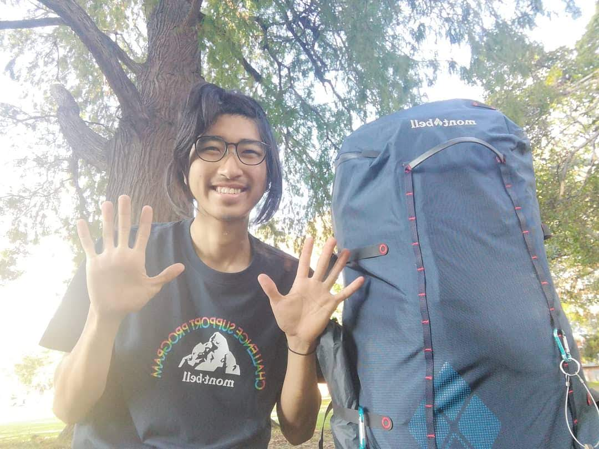
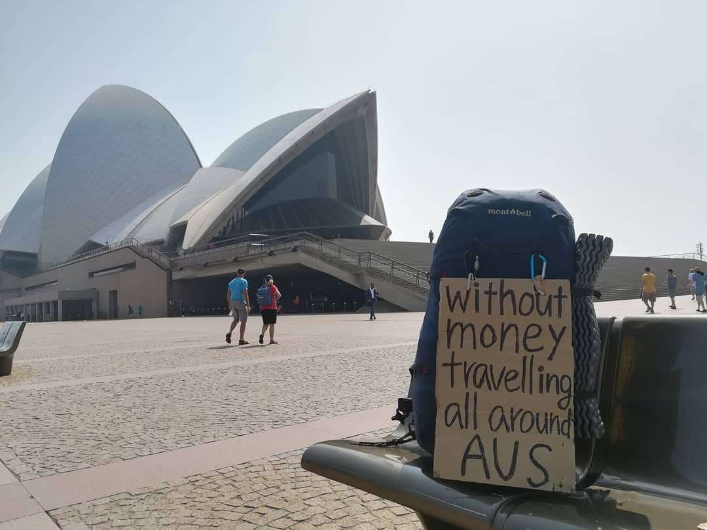
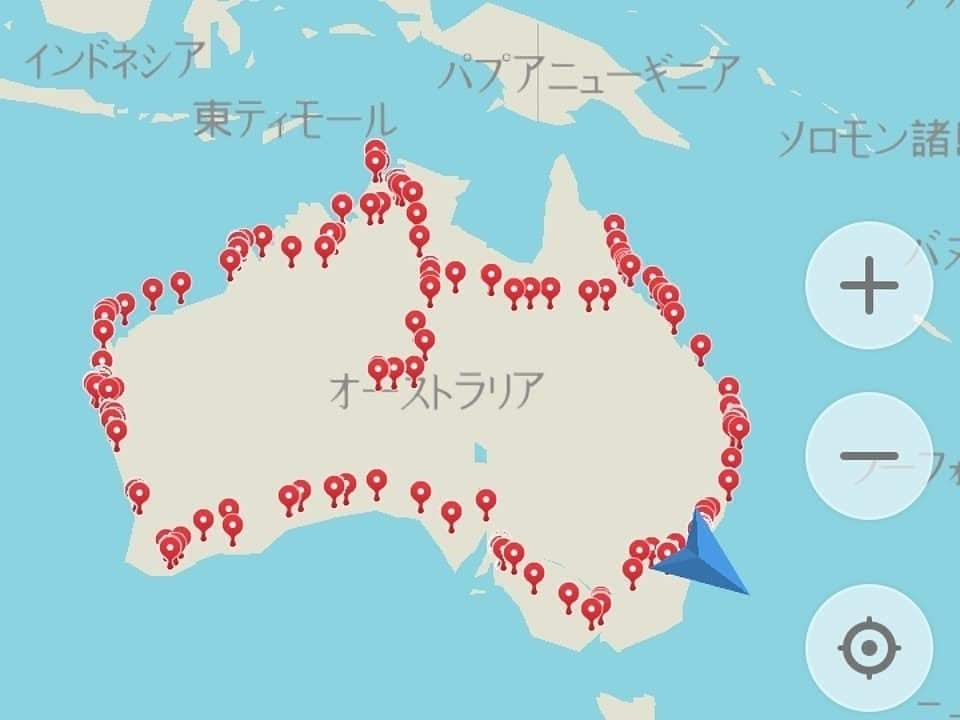

## 無一文オーストラリア一周

2019年9月から11月にかけて、66日間を使ってオーストラリアを一周しました。

この旅では、主な移動手段としてヒッチハイクを使い、寝る場所は基本的にテント泊にしました。ブリスベンを出発し、オーストラリアを反時計回りに進みながら、さまざまな都市や場所を巡りました。

ニュージーランドでのワーキングホリデーを終えた後、次に向かったのがオーストラリアでした。

## なぜオーストラリアを一周したのか

この旅でやりたかったのは、ただオーストラリアを観光することではありませんでした。

ヒッチハイクに興味を持つ人に向けて、その難しさや大変さだけではなく、面白さや楽しさ、そして人との出会いまで含めた魅力を伝えたいと考えていました。

そのために、自分自身がヒッチハイクを続けながらオーストラリアを一周して、実際にどんな旅になるのかを経験してみることにしました。

また、移動をヒッチハイク、寝る場所をテント泊にすることで、一般的な旅行とは違った形でオーストラリアを旅してみたいと思っていました。

## ヒッチハイクでオーストラリアを一周する

旅のスタートはブリスベンです。

そこから反時計回りに進み、ケアンズ、エアーズロック、ダーウィン、パース、アデレード、メルボルン、シドニー、ゴールドコーストを経由して、再びブリスベンへ戻るルートを進みました。

オーストラリアはとても広い国なので、移動距離も長くなります。

その移動をヒッチハイクでつないでいきました。

ヒッチハイクは、車に乗せてもらえれば大きく移動できますが、いつでもすぐに乗せてもらえるわけではありません。

どこで待つのか、どの方向へ向かうのか、次の場所へどうつなげるのかを自分で考えながら移動していく必要があります。

その難しさも、この旅の大きな部分でした。

## テント泊で旅を続ける

寝る場所は基本的にテント泊にしました。

移動するだけではなく、その日の寝る場所まで自分で考えながら旅を続ける必要があります。

ホテルや宿泊施設を利用する旅とは違い、毎日を自分で組み立てていくような旅になりました。

## オーストラリアの自然と気候

オーストラリアはニュージーランド以上に気候の変化が激しく、寒暖差も大きい場所でした。

広大な土地を移動していると、場所によって環境が大きく変わります。

海沿いの場所だけでなく、エアーズロックやダーウィンなども訪れながら、オーストラリアの広さを実際に感じることができました。

その一方で、自然の厳しさも感じる旅でした。

ヒッチハイクとテント泊を組み合わせているからこそ、気候や環境を直接感じながら移動することになりました。

## ヒッチハイクの難しさと面白さ

この旅を通して改めて感じたのは、ヒッチハイクには難しさがあるということです。

思ったように車が見つからないこともあり、長距離を移動するには時間も必要になります。

オーストラリアは広大なので、移動距離が長くなるほど、その大変さも大きくなります。

それでも、ヒッチハイクには普通の移動では得られない面白さがあります。

車に乗せてもらうことができれば、その人との会話や出会いが生まれます。

目的地へ移動するだけではなく、人とのつながりを感じながら旅を続けられることが、ヒッチハイクの大きな魅力だと思っています。

## 66日間を振り返って

66日間をかけてオーストラリアを一周しました。

ブリスベンから出発して反時計回りに移動し、ケアンズ、エアーズロック、ダーウィン、パース、アデレード、メルボルン、シドニー、ゴールドコーストを経由して、最後はブリスベンへ戻りました。

ヒッチハイクとテント泊を中心に旅を続けたことで、オーストラリアの広さだけではなく、移動することの難しさや、人との出会いの面白さも実際に経験することができました。

この旅を通して、ヒッチハイクには大変な部分もありますが、それだけではなく、自然や人を身近に感じながら旅ができる面白さがあることも改めて感じました。

ヒッチハイクに興味を持っている人にとって、少しでもその魅力や難しさを知るきっかけになればと思っています。

## 旅のまとめ

- 期間：2019年9月〜11月
- 日数：66日間
- 往路：オークランド → ブリスベン
- 復路：シドニー → 成田
- 主な移動手段：ヒッチハイク
- 主な宿泊方法：テント泊
- ルート：ブリスベン → ケアンズ → エアーズロック → ダーウィン → パース → アデレード → メルボルン → シドニー → ゴールドコースト → ブリスベン

