## ヒッチハイク日本一周

2018年8月10日から19日までの10日間、ヒッチハイクで日本一周をしました。

東京を出発し、まずは南へ向かって鹿児島県の佐多岬を目指しました。そこから北上し、[国道九四フェリー](https://www.koku94.jp/)で四国へ渡り、淡路島を経由して本州へ戻りました。そのまま青森まで北上し、[青函フェリー](https://www.seikan-ferry.co.jp)で北海道へ渡りました。北海道ではさらに北を目指して宗谷岬へ向かい、再び[青函フェリー](https://www.seikan-ferry.co.jp)で本州へ戻って東京まで帰ってきました。

10日間で42台の車に乗せていただきながら、このルートを走り切りました。

## 旅に出た理由

この旅をしたのは、次の旅へ出発するまでの時間を使って、日本を一周しておきたかったからです。

7月末に会社を退職し、9月からはニュージーランドでワーキングホリデーを始める予定でした。その間に日本を一周できれば、日本に対してある程度満足した状態で、ニュージーランドへ旅立てると考えていました。

10日間という短い期間ではありましたが、このタイミングで日本一周をしておきたいと思いました。

## 東京から鹿児島へ

8月10日、東京の用賀インターを出発しました。

ここから南を目指してヒッチハイクを続け、鹿児島県の佐多岬へ向かいました。

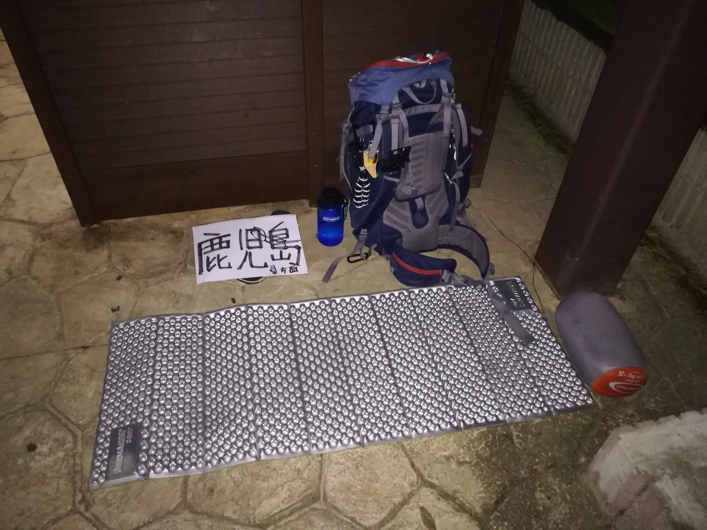

さらに南へ進み、佐多岬を目指しました。

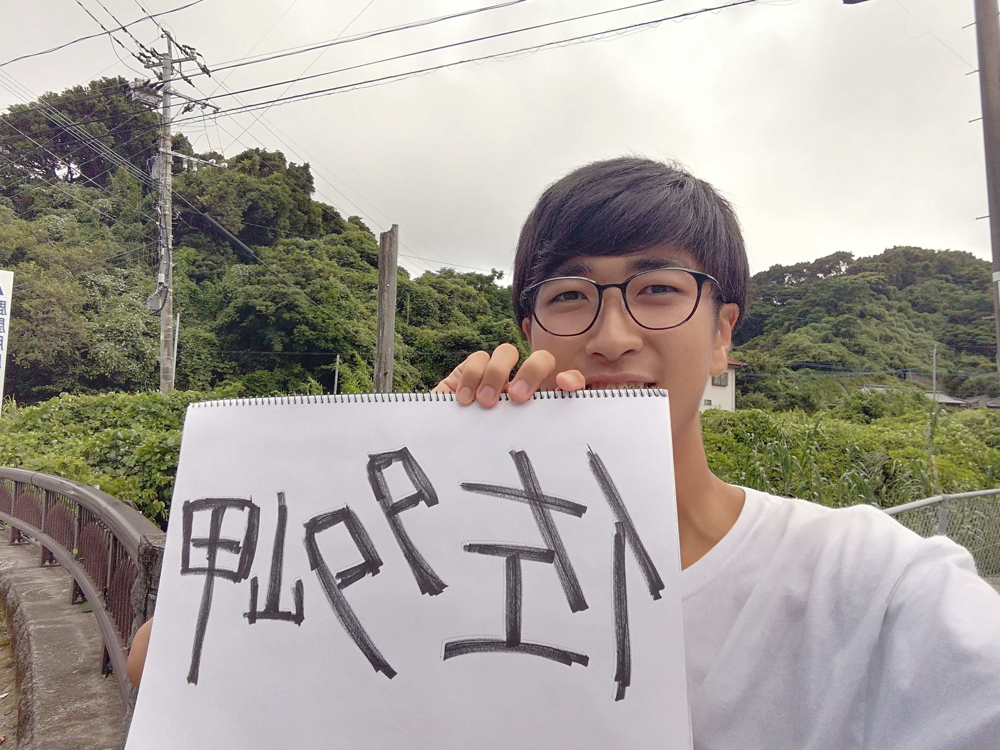

そして、日本本土最南端の佐多岬へ到着しました。

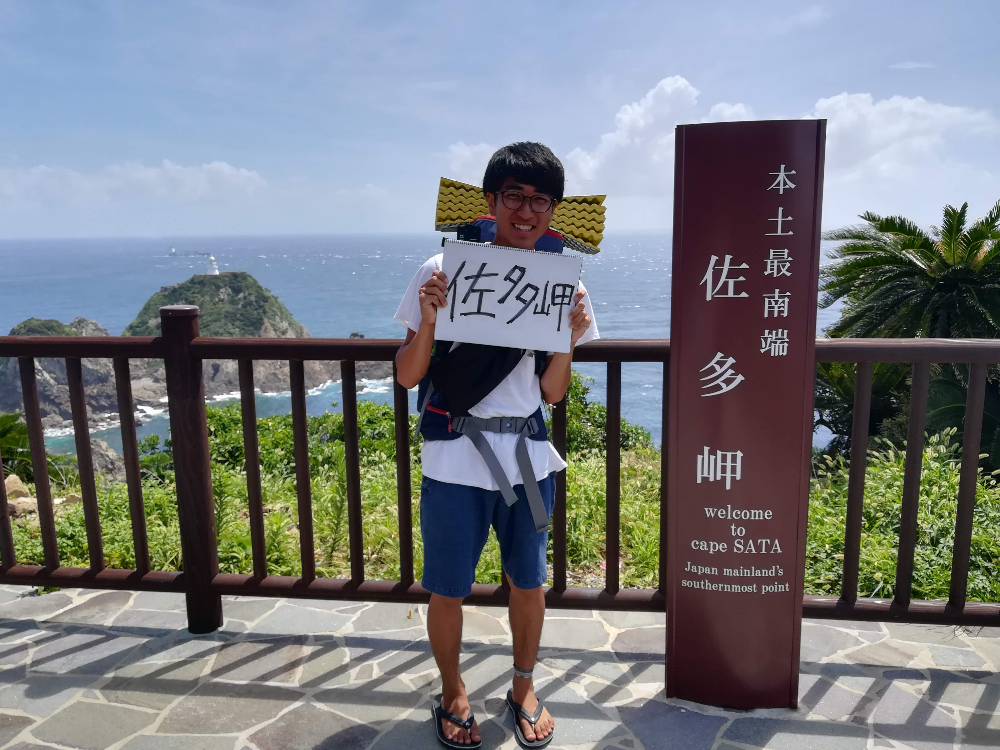

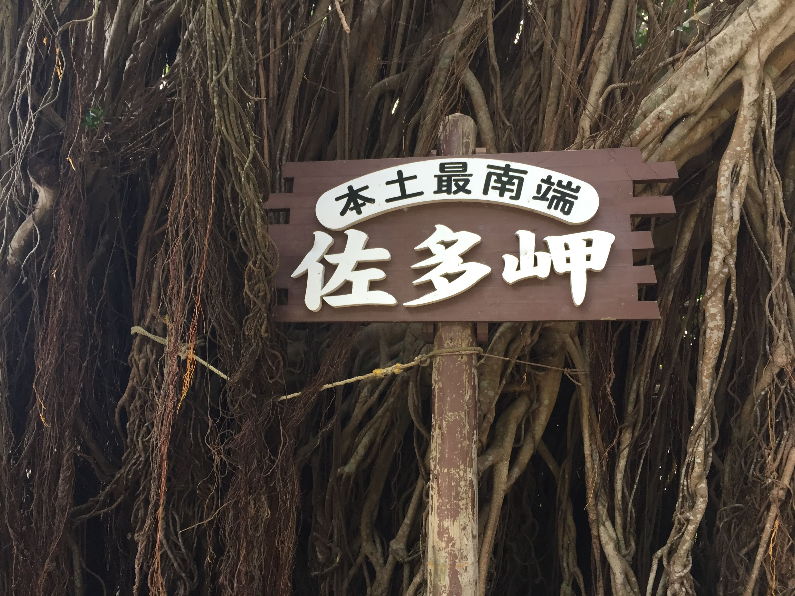

## 佐多岬から四国へ

佐多岬に到着した後は、そのまま北上しました。

九州から四国へは、[国道九四フェリー](https://www.koku94.jp/)を利用しました。

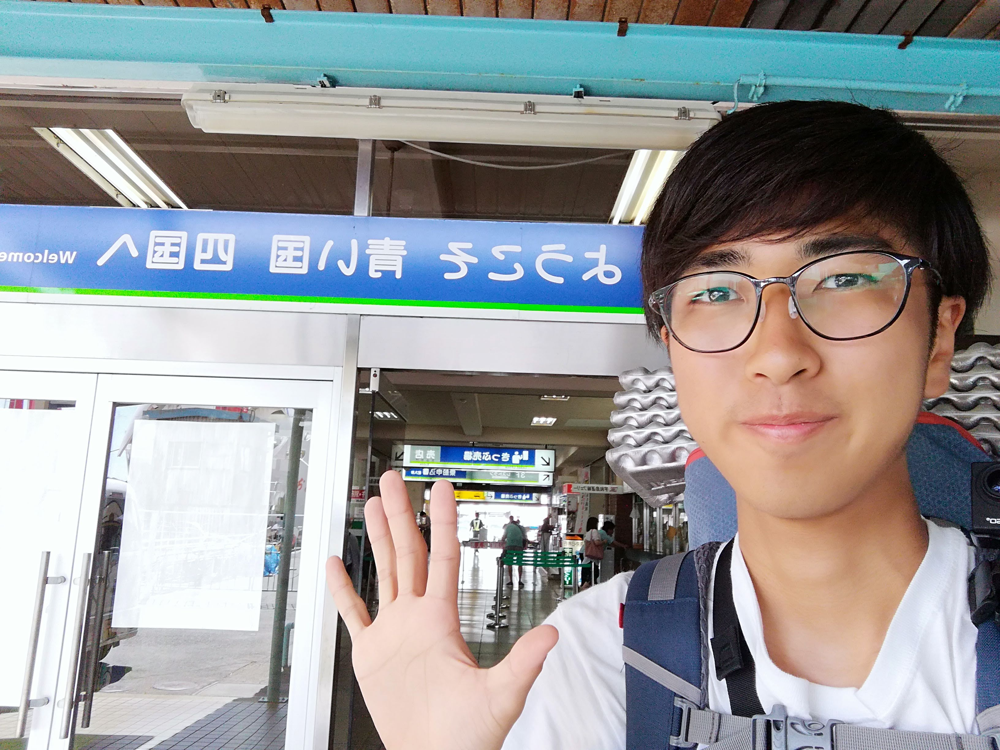

フェリーで四国へ渡り、そこからさらに東へ進みました。

四国を移動した後は、淡路島を経由して本州へ戻りました。

## 本州を北へ

本州へ戻ってからは、青森を目指してさらに北上しました。

佐多岬から今度は北へ向かい、北海道を目指して移動を続けました。

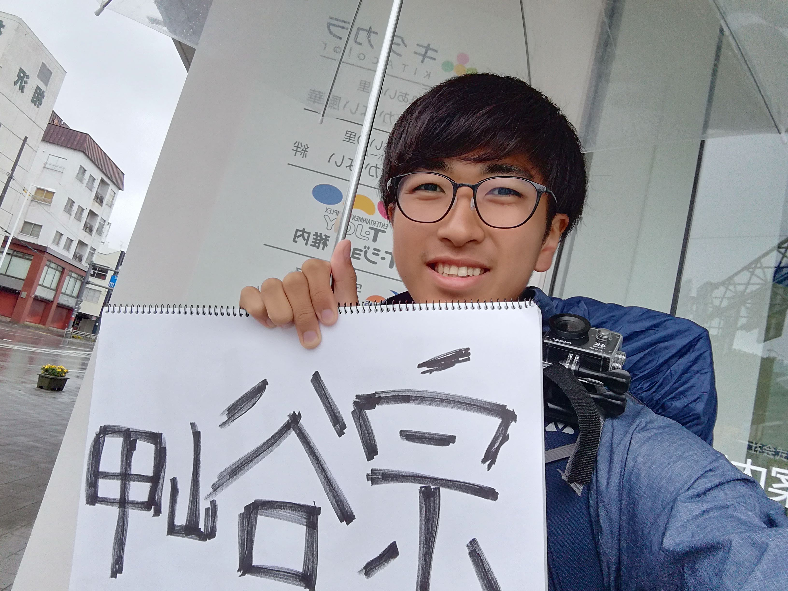

途中では野寒布岬にも立ち寄りました。

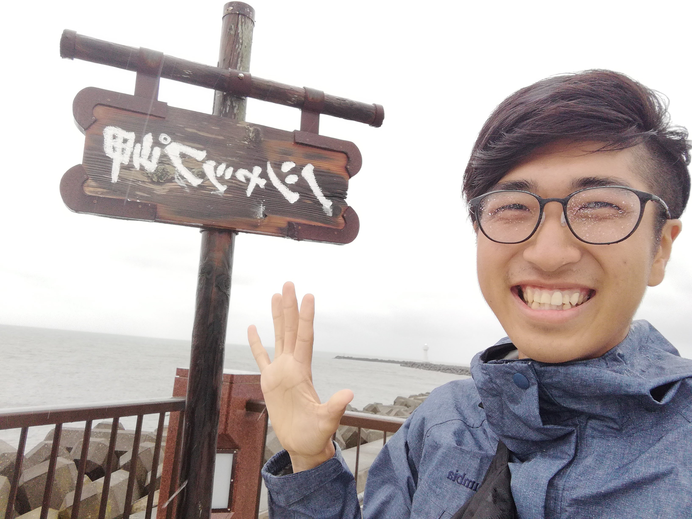

北海道ではテントで過ごしながら、さらに北へ進みました。

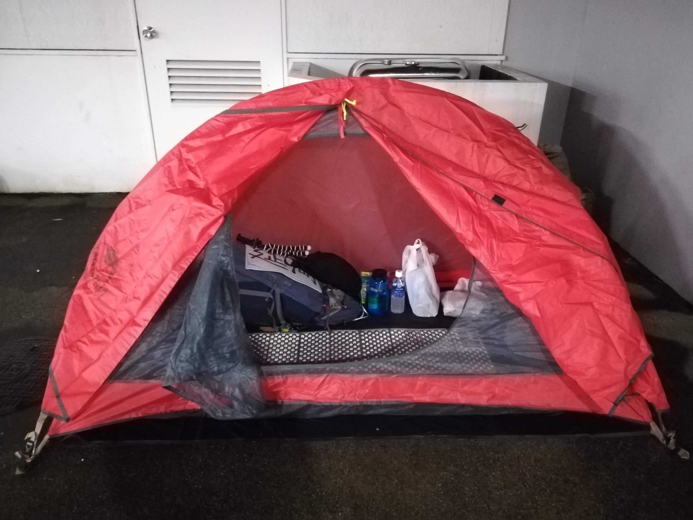

## 青森から北海道へ

青森から北海道へは、[青函フェリー](https://www.seikan-ferry.co.jp)を利用しました。

北海道へ渡った後も、目的地はさらに北です。

目指すのは宗谷岬です。

## 宗谷岬へ

北海道を北へ向かって移動を続け、宗谷岬を目指しました。

そして、宗谷岬へ到着しました。

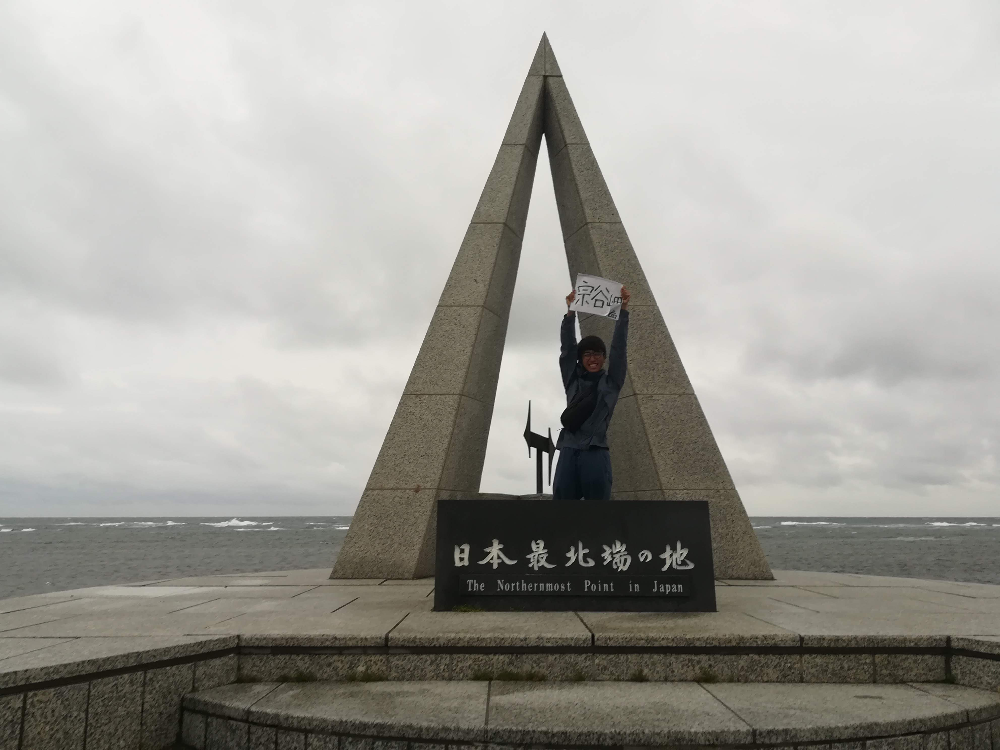

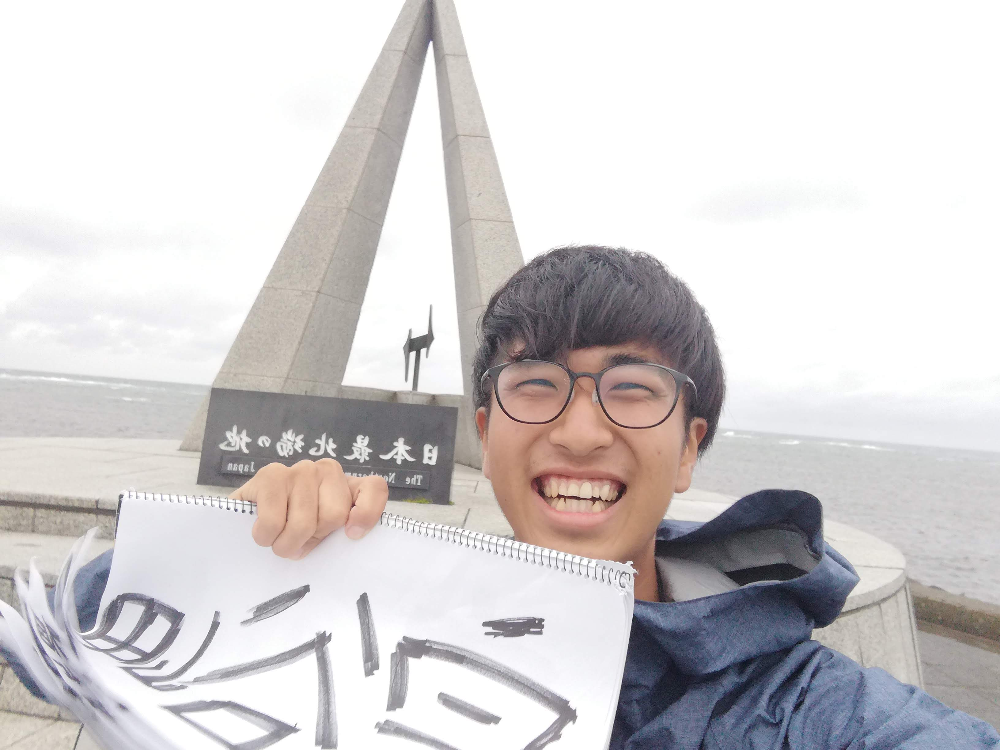

## 宗谷岬から東京へ

宗谷岬にたどり着いた後は、再び南へ向かいました。

[青函フェリー](https://www.seikan-ferry.co.jp)で北海道から本州へ戻り、そこから東京を目指しました。

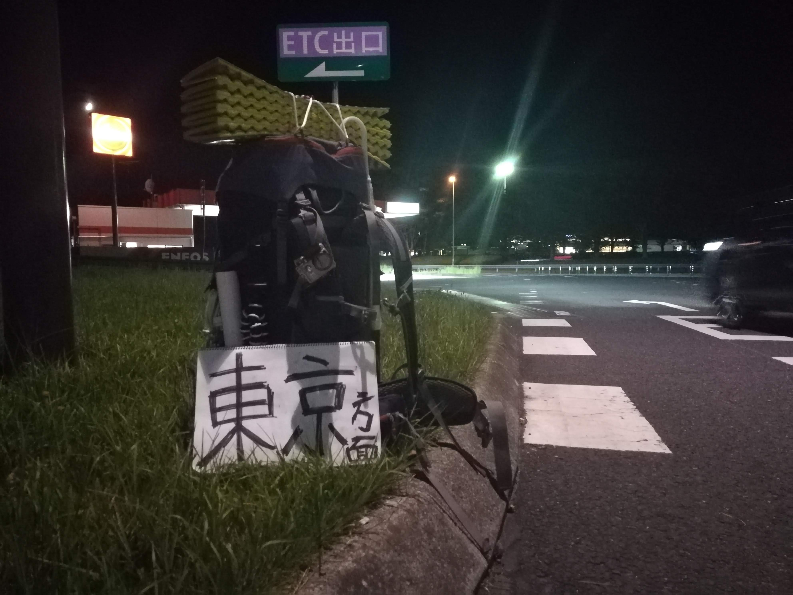

8月19日、東京へ戻り、日本一周をしました。

## 10日間を振り返って

8月10日に東京を出発し、鹿児島の佐多岬まで南下しました。

そこから北へ向かい、[国道九四フェリー](https://www.koku94.jp/)で四国へ渡り、淡路島を経由して本州へ戻りました。

そのまま青森まで北上し、[青函フェリー](https://www.seikan-ferry.co.jp)で北海道へ渡りました。

北海道ではさらに北へ向かい、宗谷岬までたどり着きました。

そして再び[青函フェリー](https://www.seikan-ferry.co.jp)で本州へ戻り、東京へ帰ってきました。

この10日間で、42台の車に乗せていただきました。

短い期間ではありましたが、日本一周をすることができました。

旅を終えたときには、10日間でもやり切ることができたという達成感がありました。

9月からはニュージーランドでワーキングホリデーを始める予定でした。

日本一周をしたことで、日本に対してある程度満足した状態になり、心置きなく次の旅へ向かうことができました。

2018年8月10日から19日までの10日間で、日本一周をしました。

## 旅のまとめ

* 期間：2018年8月10日〜8月19日
* 日数：10日間
* 移動手段：ヒッチハイク
* 出発地：東京・用賀インター
* ルート：東京 → 鹿児島・佐多岬 → [国道九四フェリー](https://www.koku94.jp/) → 四国 → 淡路島 → 本州 → 青森 → [青函フェリー](https://www.seikan-ferry.co.jp) → 北海道・宗谷岬 → [青函フェリー](https://www.seikan-ferry.co.jp) → 東京
* 乗車した車：約42台

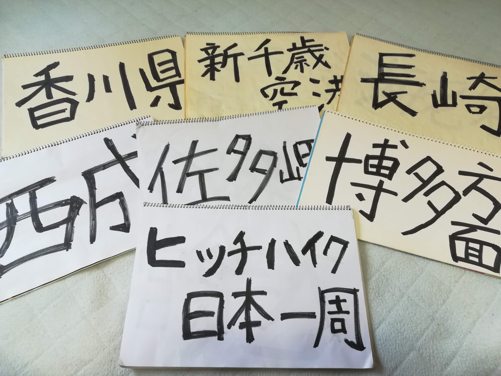
