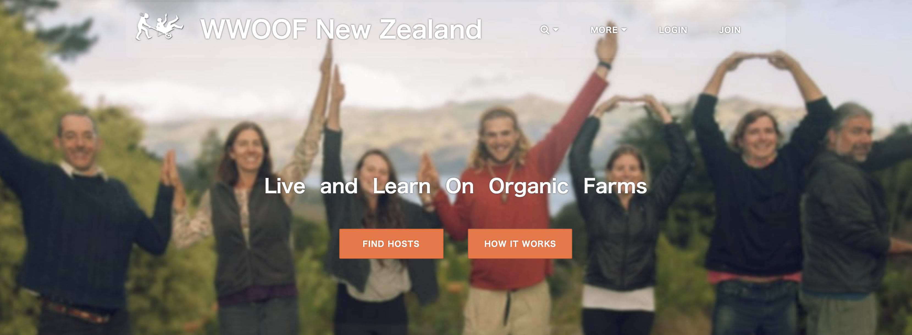
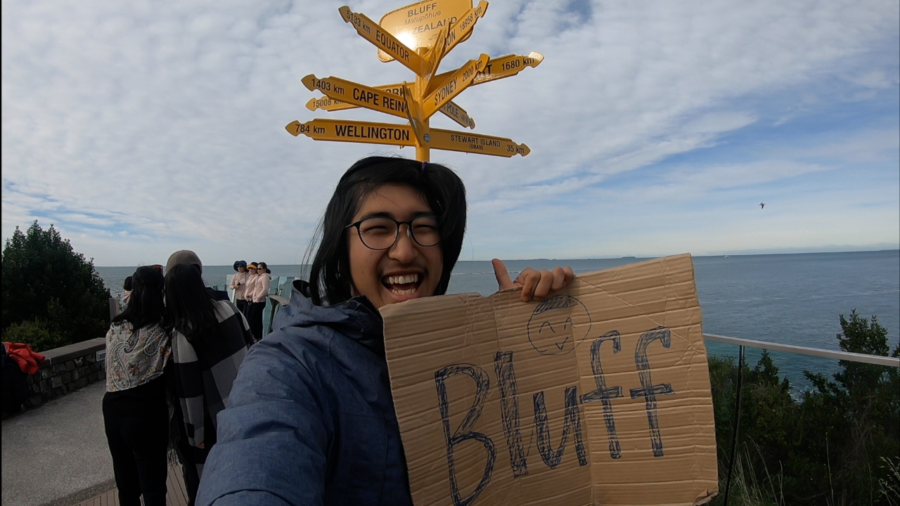
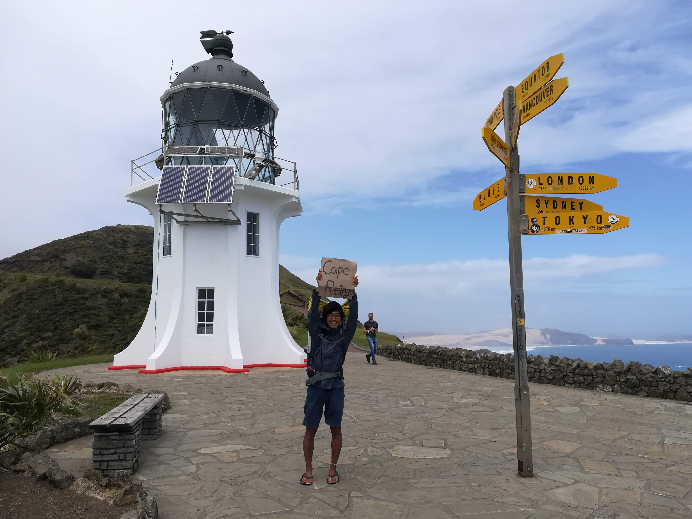

## ニュージーランドゼロ円ワーホリ

ニュージーランドで1年間、ワーキングホリデービザを使って滞在しました。

この旅で目指したのは、できるだけお金を使わずにニュージーランドを放浪することでした。

ここでいう「ゼロ円ワーホリ」とは、**移動、食事、住居にお金を掛けずにワーキングホリデービザで滞在すること**です。

そのために利用したのが、WWOOFとヒッチハイクでした。

## ゼロ円ワーホリという旅

海外で長期間暮らすとなると、移動費や食費、宿泊費など、さまざまな場面でお金が必要になります。

そこで、それぞれにお金を掛けない方法を考えました。

移動はヒッチハイク。

食事と住居はWWOOF。

この2つを組み合わせることで、できるだけお金を使わずにニュージーランドを移動しながら生活しました。

## WWOOFで暮らす

食事と住居を支えてくれたのがWWOOFです。

WWOOFは、労働力と食事・住居を交換するワークエクスチェンジのサービスです。

WWOOFを利用すると、受け入れ先で仕事をする代わりに、食事や住む場所を提供してもらうことができます。

ニュージーランドでは、WWOOFを利用してさまざまな場所を転々としながら生活しました。

一つの場所に長く滞在するのではなく、次の場所へ移動しながら、その土地で生活していく。

これが、この旅の基本的なスタイルでした。

## ヒッチハイクで移動する

WWOOFで滞在する場所を変えるためには、当然ながら移動する必要があります。

そこで利用したのがヒッチハイクです。

車に乗せてもらいながら次の滞在先へ向かうことで、移動費を掛けずにニュージーランドを移動しました。

日本一周でヒッチハイクを経験していたこともあり、ニュージーランドでもヒッチハイクを使って旅を続けることができました。

WWOOFで食事と住居を確保し、ヒッチハイクで移動する。

この組み合わせによって、滞在しながらニュージーランドを放浪することができました。

## 1年間のワーキングホリデーを振り返って

ニュージーランドでの1年間は、一般的な旅行とは少し違う旅になりました。

ホテルに泊まり、交通機関を使って観光地を巡るのではなく、WWOOFで滞在する場所を変えながら、ヒッチハイクで次の場所へ移動しました。

働いて食事と住居を得て、移動するときはヒッチハイクを使う。

その繰り返しで、1年間ニュージーランドで生活しました。

お金を使わない代わりに、自由に使えるお金を増やす旅ではありません。

移動も住む場所も、その都度自分で探していく必要があります。

それでも、こうした方法を組み合わせることで、ワーキングホリデーという制度を使いながら、ニュージーランドを長期間放浪することができました。

## まとめ

- 期間：2018年9月10日(成田出発), 12日 〜 2019年9月12日
- 日数：365日間
- 往路：成田 → オークランド
- 復路：ニュージーランド（オークランド） → オーストラリア（シドニー）

